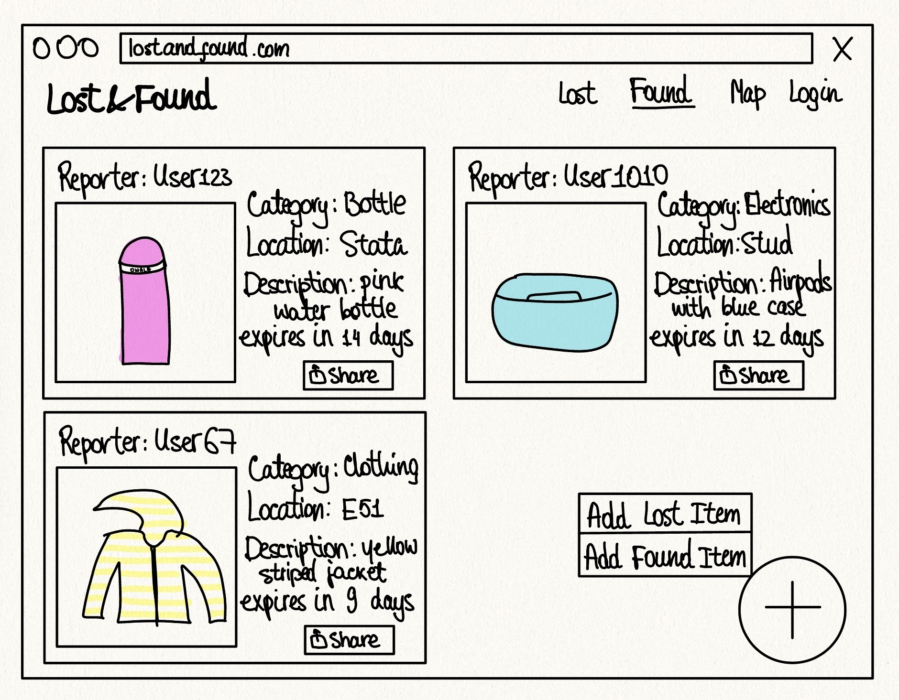
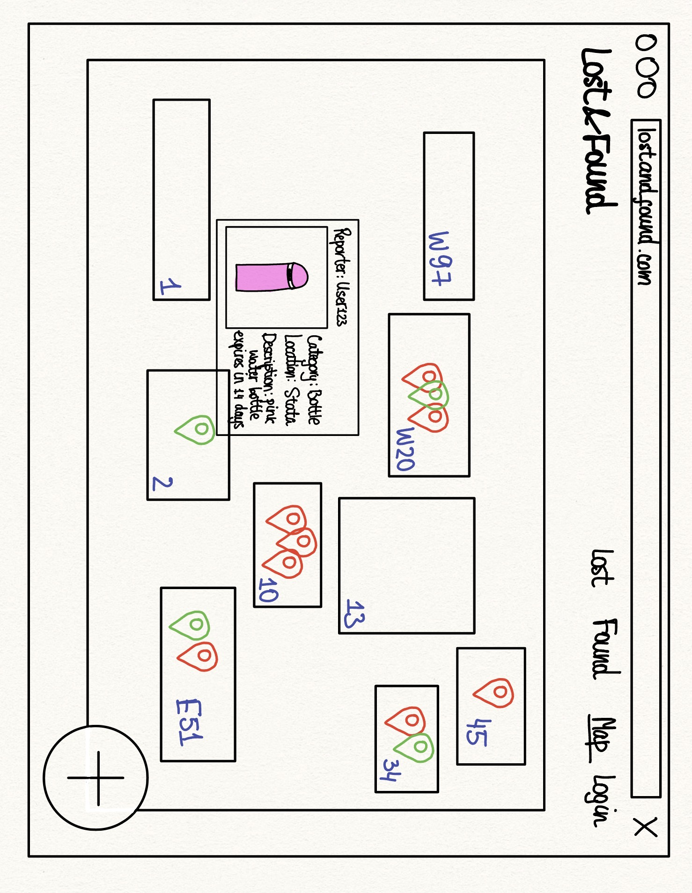

## Sketch 1: Found list

- **Navigation bar.** "Lost" and "Found" switch between the list of lost reports and the list of found reports. "Map" opens the campus map (Sketch 2). "Login" is for MIT accounts only.
- **Report card.** Each open report is one card with a photo, the reporter, the category, the building picked from a dropdown when the report was posted, and a short description.
- **Expires in N days.** Every report disappears after 14 days unless the reporter confirms that the item is still there, so old posts do not pile up.
- **Share.** Copies a link to the report, so it can be pasted into dormspam or a group chat.
- **Plus button.** Clicking it expands two options, "Add Lost Item" and "Add Found Item". Each opens a short form: photo, category, building, and description.

## Sketch 2: Map

- **Buildings.** Each rectangle is an MIT building, labeled with its number.
- **Pins.** Every open report is a pin on the building it was posted for. Found items have green pins and lost items have red pins. A lost report can have a pin on several buildings, because the owner often does not know where the item was lost.
- **Clicking a pin** opens that report's card, the same card as in Sketch 1.
- **Plus button.** Works the same way as in Sketch 1.